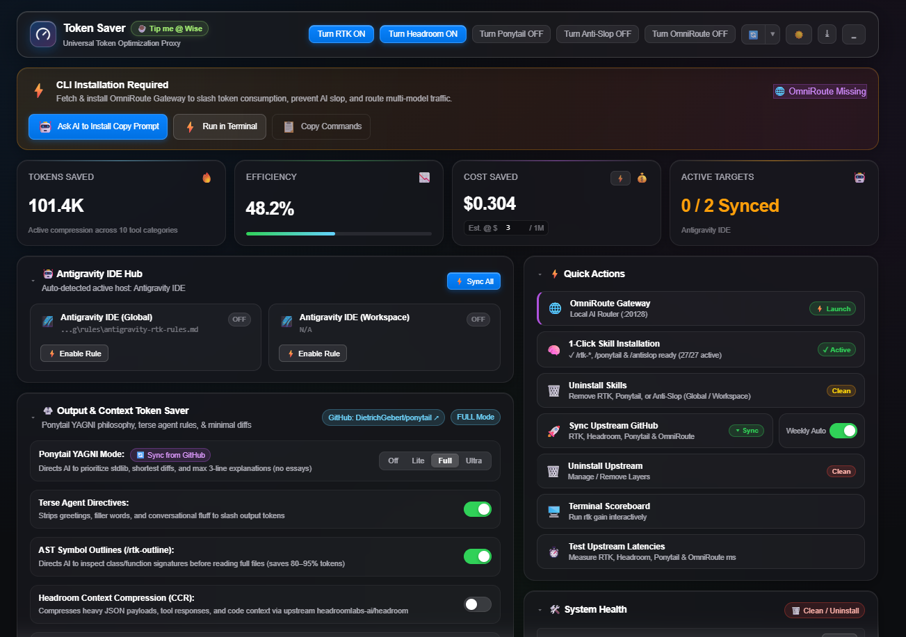
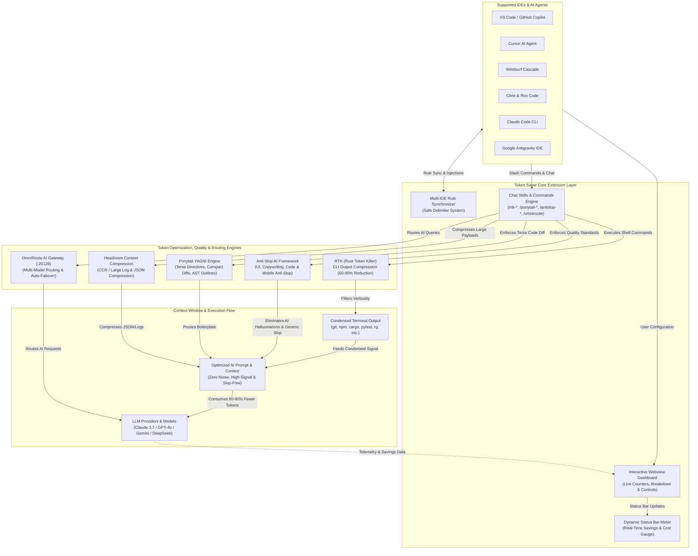
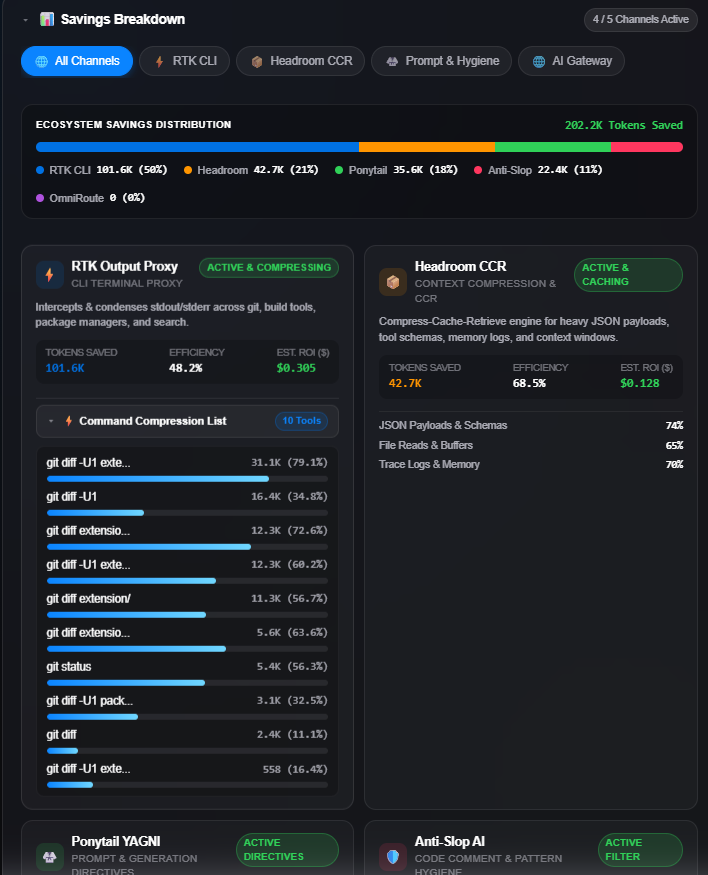

# ⚡ Token Saver for VS Code & Agentic IDEs

[](https://opensource.org/licenses/MIT)
[](https://open-vsx.org/extension/terenceooi/token-saver-rtk-ide)
[](https://wise.com/pay/me/terenceooit)
[](https://code.visualstudio.com)
[](https://cursor.com)
[](https://codeium.com/windsurf)
[](https://github.com/terenceooi99/token-saver-rtk-ide)

**Token Saver (RTK, Headroom, Ponytail, Anti-Slop & OmniRoute)** is an all-in-one token optimization and AI quality suite with CLI output compression proxy. Powered by [RTK (Rust Token Killer)](https://www.rtk-ai.app), [Headroom context compression](https://github.com/headroomlabs-ai/headroom), [Ponytail YAGNI mode](https://github.com/DietrichGebert/ponytail), [Anti-Slop AI Quality Framework](https://github.com/miqdadbadjuber/anti-slop), and [OmniRoute AI Gateway](https://github.com/diegosouzapw/OmniRoute), it slashes AI context window token consumption by **60% - 90%** during terminal command execution (`git`, `cargo`, `npm`, `pnpm`, `pytest`, `vitest`, `rg`, `ls`, `tree`, etc.) and enforces production-grade anti-slop quality across **all major Agentic AI IDEs and coding assistants**.

<p align="center">
  
</p>

---

## 🏗️ Architectural Flowchart

The following flowchart illustrates how **Token Saver** bridges multiple AI IDEs, coordinates five specialized optimization & quality engines, and optimizes terminal output & prompt context before hitting LLM models:



---

## 🌐 Supported IDEs & AI Agent Ecosystem

| IDE / AI Agent | Rule / Configuration Target | How Token Saver Integrates |
| :--- | :--- | :--- |
| **VS Code (GitHub Copilot)** | `.github/copilot-instructions.md` | Injects RTK command rules & terse generation directives for Copilot Chat & agent mode |
| **Cursor IDE** | `.cursorrules` & `.cursor/rules/rtk.mdc` | Automatically instructs Cursor Agent to route CLI tasks via RTK & optimize context |
| **Windsurf IDE (Cascade)** | `.windsurfrules` | Instructs Cascade agent to prefix shell executions with RTK |
| **Cline & Roo Code** | `.clinerules` | Directs autonomous agents to use RTK for zero token waste |
| **Claude Code (Anthropic)** | `CLAUDE.md` | Configures Claude CLI agent with RTK execution & Headroom guidelines |
| **Universal Agents** | `AGENTS.md` | Standard cross-agent markdown format for OpenCode, Aider, etc. |
| **Google Antigravity IDE** | `~/.gemini/config/` & `.agents/` | Global & workspace rules plus native slash commands (`/rtk-*`) |

---

## 🎯 Dual-Mode Simultaneous Architecture & Interactive Dashboard

> ⚡ **Zero-Setup Out-of-the-Box**: Immediately after installing this plugin, **Way 1 (Chat / Slash Commands)** and **Way 2 (GUI Status Bar & Webview Dashboard)** are **both automatically active and available simultaneously**.

```
┌────────────────────────────────────────────────────────────────────────┐
│             TOKEN SAVER (RTK) SIMULTANEOUS DUAL-MODE ARCHITECTURE      │
├───────────────────────────────────┬────────────────────────────────────┤
│ WAY 1: Chat / Slash Commands      │ WAY 2: Extension & Dashboard       │
│ (In-Chat / Direct Agent Control)  │ (GUI Status Bar & Webview Panel)   │
├───────────────────────────────────┼────────────────────────────────────┤
│ • Ready immediately upon install  │ • Live Status Bar: 48k saved (72%) │
│ • Type / in chat for instant menu │ • Interactive Webview Dashboard    │
│ • /rtk-update (GitHub Sync)       │ • Multi-IDE & Agent Sync Hub       │
│ • /rtk-savedtokenon (Enable)      │ • Upstream GitHub RTK auto-sync    │
│ • /rtk-savedtokenoff (Disable)    │ • Automatic rules synchronization  │
│ • /rtk-gain (View Scoreboard)     │ • Real-time token savings gauge    │
│ • /rtk-doctor (Diagnostics)       │ • Ponytail & Headroom controls     │
│ • /rtk-outline (AST / Symbols)    │ • Compact Diff & AST Outliner      │
│ • /rtk-diff (Compact Diffs)       │ • 1-Click AI Agent installer       │
└───────────────────────────────────┴────────────────────────────────────┘
```

---

## 🚀 Way 1: Chat & Slash Commands (Antigravity & Agent Skills)

**Automatically configured upon plugin install!** Trigger commands directly in your AI assistant chat simply by typing `/`:

| Slash Command | Action |
| :--- | :--- |
| **`/rtk-savedtokenon`** | **Enables automated RTK compression**. AI routes all terminal/shell actions through `rtk` (e.g. `rtk git status`, `rtk cargo test`, `rtk npm test`). |
| **`/rtk-savedtokenoff`** | **Disables RTK mode**. Reverts to standard unproxied command execution. |
| **`/rtk-gain`** | **Displays live token savings scoreboard** and efficiency metrics. |
| **`/rtk-roi`** | **Calculates estimated dollar cost savings** and model-by-model ROI. |
| **`/rtk-diff`** | **Inspects compact git diffs** (`-U1`) to save 50-70% diff tokens. |
| **`/rtk-outline`** | **Generates AST / symbol outlines** (classes, signatures) before reading full file contents. |
| **`/rtk-tree`** | **Generates token-optimized project structure map**, filtering vendor/cache bloat. |
| **`/rtk-compress`** | **Compresses large JSON payloads, stack traces, and verbose logs** using Headroom CCR. |
| **`/rtk-doctor`** | **Runs health checks & diagnostics** for RTK, Headroom, and environment configs. |
| **`/rtk-sync`** | **1-Click syncs RTK & Headroom rules** across all AI agent files. |
| **`/rtk-run <cmd>`** | **Runs arbitrary shell command** through RTK output compression proxy. |
| **`/rtk-update`** | **Checks and updates RTK, Headroom, Ponytail, Anti-Slop & OmniRoute** from upstream GitHub releases. |
| **`/rtk-omniroute`** | **Configures OmniRoute AI Gateway & Smart Router** for low-latency multi-model routing & rate-limit evasion. |
| **`/ponytail`** | **Configures Ponytail YAGNI mode** for concise code diffs & terse generation. |
| **`/ponytail-audit`** | **Whole-repo audit for over-engineering** and speculative code. |
| **`/ponytail-debt`** | **Tracks shortcut debt ledger** marked with `ponytail:` comments. |
| **`/ponytail-gain`** | **Displays measured-impact scoreboard** from benchmarks. |
| **`/ponytail-help`** | **Displays Ponytail reference card** and intensity levels. |
| **`/ponytail-review`** | **Reviews diffs exclusively for over-engineering**. |
| **`/antislop`** | **Configures Anti-Slop AI rules** & review mode (`during`, `after`, `ask`, `off`). |
| **`/antislop-ui`** | **Enforces Anti-Slop UI standards**: human-designed layouts, real spacing, typography & contrast. |
| **`/antislop-copywriting`** | **Enforces Anti-Slop copywriting**: eliminates AI filler words ("delve", "testament", "tapestry"). |
| **`/antislop-human`** | **Applies human UX principles** with automated WCAG contrast checker scripts. |
| **`/antislop-layoutmobile`** | **Validates mobile-first constraints** and touch target compliance. |
| **`/antislop-code`** | **Enforces clean, maintainable, anti-slop code structure** without AI bloat. |
| **`/publishtokensaverlocal`** | **Builds local `.vsix`** for immediate internal IDE testing. |
| **`/publishtokensavernow`** | **Automates release tagging and publishing** to Open VSX & GitHub Releases. |

*(Optional Manual Re-install)*:
- **Command Palette**: `Token Saver: 1-Click Skill Installation (/rtk-*, /ponytail, /antislop)`
- **Windows (PowerShell)**: `.\scripts\install-skills.ps1`
- **Linux / macOS (Bash)**: `./scripts/install-skills.sh`

---

## 🧩 Way 2: Primary Sidebar & Webview Dashboard (Multi-IDE Hub)

The extension provides full graphical and automated control directly from your **Primary Sidebar** and editor for **VS Code**, **Cursor**, **Windsurf**, **Antigravity**, and all OpenVSX-compatible editors.

### 🌟 Key Features:
1. **Primary Sidebar Interactive Dashboard**:
   - Click the **RTK Meter icon** on the Activity Bar / Primary Side Bar to instantly view and manage RTK optimization in a compact, sleek view.
   - Includes a **Pop Out to Editor Tab** button (`⤢`) to expand into a full-width dashboard at any time.
2. **Multi-IDE & AI Agent Synchronization Hub**:
   - 1-Click sync to `.github/copilot-instructions.md`, `.cursorrules`, `.windsurfrules`, `.clinerules`, `CLAUDE.md`, `AGENTS.md`, and `~/.gemini/config/`.
   - **Safe Delimiter System**: Preserves existing project instructions using `<!-- RTK_TOKEN_SAVER_START -->` blocks.
3. **Interactive Glassmorphic Dashboard**:
   - Live Token Savings Counter with animated visual meters.
   - Compression Efficiency Gauge (%) and Estimated Dollar Savings ($).
   - Per-tool visual savings charts (`git`, `cargo`, `npm`, `pytest`, `vitest`, `rg`, `ls`, etc.).
   - Action center with 1-click skill sync, Ponytail & Anti-Slop GitHub sync, GitHub release update check, and proxy latency test.
   - Diagnostics panel displaying local binary path, version, and active target counts.

<p align="center">
  
</p>

4. **Upstream GitHub 4-Way Core Sync (RTK, Headroom, Ponytail & Anti-Slop)**:
   - Automatic non-intrusive update checks against official GitHub releases (`rtk-ai/rtk`, `headroomlabs-ai/headroom`, `DietrichGebert/ponytail`, & `miqdadbadjuber/anti-slop`).
   - 1-click update trigger for Windows (`winget`), macOS (`brew`), and Linux (`curl`), plus GitHub skill fetch for Ponytail and Anti-Slop.
5. **Dynamic Live Status Bar**:
   - Shows real-time savings: `⚡ RTK: 48.2k saved (72%)` or `⚪ RTK: OFF`.
   - Rich hover tooltips with cost savings and quick access to the dashboard.
6. **Commands in Command Palette (`Ctrl+Shift+P` / `Cmd+Shift+P`)**:
   - `Token Saver: Open Interactive Dashboard`
   - `Token Saver: Sync Rules to All AI Agents (VS Code, Cursor, Windsurf, Cline, Claude, Antigravity)`
   - `Token Saver: Configure Target Agentic IDEs / AI Rules`
   - `Token Saver: Toggle RTK Token Saving Mode`
   - `Token Saver: Enable RTK Token Saving`
   - `Token Saver: Disable RTK Token Saving`
   - `Token Saver: Check for Upstream GitHub Updates`
   - `Token Saver: Update from Upstream GitHub`
   - `Token Saver: Fetch & Sync Ponytail from GitHub`
   - `Token Saver: Fetch & Sync Anti-Slop from GitHub`
   - `Token Saver: Configure Anti-Slop Mode (during / after / ask / off)`
   - `Token Saver: Toggle Headroom Context Compression`
   - `Token Saver: Configure Ponytail Mode (YAGNI & Output Token Saver)`
   - `Token Saver: Run Compact Diff (rtk git diff -U1)`
   - `Token Saver: Generate AST / Symbol Outline for Current File`
   - `Token Saver: 1-Click Skill Installation (/rtk-*, /ponytail, /antislop)`
   - `Token Saver: Sync Global Antigravity Rules (~/.gemini)`
   - `Token Saver: Show Token Savings Scoreboard (rtk gain)`
   - `Token Saver: Install RTK CLI Tool`
   - `Token Saver: Copy AI Agent Install Prompt`
   - `Token Saver: Copy Raw Shell Install Commands`

---

## ⚙️ Extension Settings

| Setting | Default | Description |
| :--- | :--- | :--- |
| `tokenSaver.enableOnStartup` | `true` | Automatically enable RTK token compression when opening a project. |
| `tokenSaver.headroomEnabled` | `true` | Enable Headroom context compression (CCR / SmartCrusher / CodeCompressor). |
| `tokenSaver.autoInstallSkills` | `true` | Automatically install Antigravity & Agent chat skills (`/rtk-*`, `/ponytail-*`, `/antislop-*`) on startup. |
| `tokenSaver.targetScope` | `"all"` | Target IDE / Agent rule scope (`all`, `global`, `workspace`, `copilot`, `cursor`, `windsurf`, `cline`, `claude`, `agents`). |
| `tokenSaver.checkForUpdatesOnStartup` | `true` | Check for newer RTK & Headroom releases on startup. |
| `tokenSaver.weeklyAutoSync` | `true` | Weekly background check and sync for upstream releases. |
| `tokenSaver.tokenPricePerMillion` | `3.00` | Estimated USD price per 1M tokens for dollar savings calculation. |
| `tokenSaver.statusMetricDisplay` | `"compact"` | Format of live metrics in status bar (`compact`, `verbose`, `iconOnly`). |
| `tokenSaver.ponytailMode` | `"full"` | Ponytail YAGNI mode (`full`, `lite`, `ultra`, `off`). |
| `tokenSaver.antiSlopEnabled` | `true` | Enable Anti-Slop AI quality and slop elimination framework. |
| `tokenSaver.antiSlopMode` | `"during"` | Anti-Slop review execution mode (`during`, `after`, `ask`, `off`). |
| `tokenSaver.terseAgentMode` | `true` | Instruct agents to drop conversational filler to maximize output token savings. |
| `tokenSaver.compactDiffContext` | `true` | Direct AI agents to use `-U1` compact context for git diffs. |
| `tokenSaver.astOutlineContext` | `true` | Direct AI agents to inspect symbol outlines before reading full files. |

---

## 📦 Prerequisites: Installing RTK CLI

Token Saver functions best with the `rtk` binary installed on your system.

### Windows:
```powershell
winget install --id rtk-ai.rtk --accept-source-agreements --accept-package-agreements
```

### macOS / Linux:
```bash
brew install rtk-ai/tap/rtk
# or
curl -fsSL https://raw.githubusercontent.com/rtk-ai/rtk/main/install.sh | bash
```

### Verify Installation:
```bash
rtk --version
rtk gain
```

---

## 🛠 Multi-IDE Rule Sync via Terminal

You can also synchronize rules directly from terminal:

- **Windows PowerShell**:
  ```powershell
  .\scripts\install-all-ide-rules.ps1
  ```
- **macOS / Linux Bash**:
  ```bash
  ./scripts/install-all-ide-rules.sh
  ```

---

## 📦 Packaging & Publishing

1. **Package Local VSIX**:
   ```bash
   npm run package
   # or
   npx @vscode/vsce package
   ```

2. **Publish to Open VSX**:
   ```bash
   npx ovsx publish token-saver-rtk-ide-<Current-Version>.vsix -p <YOUR_OPENVSX_ACCESS_TOKEN>
   ```

3. **Automated Tag & CI Release**:
   ```bash
   # Or trigger 1-click automated release tagging via chat:
   /publishtokensavernow
   ```

---

## ☕ Support & Sponsor

If Token Saver helps you save tokens, accelerate agent development, or lower your LLM API bills, please consider supporting the project!

[](https://wise.com/pay/me/terenceooit)

- **Direct Wise Link**: [https://wise.com/pay/me/terenceooit](https://wise.com/pay/me/terenceooit)

---

## 👤 Author & Maintainer

- **Terence** — [terenceooi1688@gmail.com](mailto:terenceooi1688@gmail.com)
- **GitHub**: [terenceooi99/token-saver-rtk-ide](https://github.com/terenceooi99/token-saver-rtk-ide)
- **Sponsor / Tip**: [Tip me @ Wise](https://wise.com/pay/me/terenceooit)

---

## 📄 License

This project is licensed under the [MIT License](LICENSE).